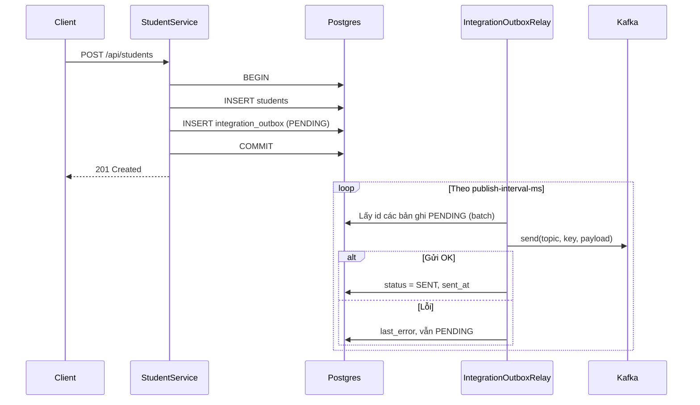

# Kafka — Transactional Outbox (Student Created)

Tài liệu mô tả cách dự án đảm bảo **sự kiện tạo student** được đưa lên Kafka **sau khi DB commit**, và **không mất việc gửi** khi broker tạm lỗi (message vẫn nằm trong bảng outbox cho tới khi gửi thành công).

## Vì sao cần outbox?

Nếu **ghi DB xong** rồi mới **gửi Kafka** trong cùng request mà không lưu “hẹn gửi”:

- Kafka lỗi → student đã có trong DB nhưng **không có message** → các service phụ thuộc Kafka **không nhận được** sự kiện.

**Transactional outbox:** trong **một transaction** với nghiệp vụ, insert thêm một dòng vào bảng `integration_outbox`. Sau đó một **relay** (scheduler) đọc các dòng `PENDING`, gửi Kafka, cập nhật `SENT` hoặc ghi `last_error` và **giữ PENDING** để thử lại.

## Luồng tổng quát

## Cấu hình

| Thuộc tính | Mô tả | Mặc định (application.yaml) |
|------------|--------|------------------------------|
| `app.kafka.enabled` | Bật Kafka + bean publisher + relay | `false` (local dùng `application-local.yaml`) |
| `app.kafka.topic-prefix` | Tiền tố topic | `app-platform` |
| `app.kafka.outbox.relay-enabled` | Bật/tắt relay polling trong app | `true` |
| `app.kafka.outbox.publish-interval-ms` | Khoảng cách giữa hai lần poll outbox | `2000` |
| `app.kafka.outbox.batch-size` | Số bản ghi tối đa mỗi lần poll | `50` |

Relay chỉ được tạo khi `app.kafka.enabled=true` (`IntegrationOutboxRelay` có `@ConditionalOnProperty`).

## Schema bảng `integration_outbox`

Định nghĩa Flyway: `persistence/src/main/resources/db/migration/V3__integration_outbox.sql`.

| Cột | Ý nghĩa |
|-----|---------|
| `id` | UUID khóa chính |
| `topic` | Topic Kafka (vd. `app-platform.student.created`) |
| `message_key` | Key gửi lên Kafka (vd. UUID student) |
| `payload` | JSON (vd. `StudentCreatedEvent`) |
| `status` | `PENDING` \| `SENT` |
| `created_at` | Thời điểm ghi outbox |
| `sent_at` | Thời điểm gửi thành công |
| `last_error` | Thông báo lỗi lần gửi gần nhất (nếu có) |

## Code liên quan (tham chiếu nhanh)

| Thành phần | Vai trò |
|------------|---------|
| `StudentServiceImpl` | Sau `save(student)`, gọi `enqueueStudentCreatedOutbox` — insert outbox **cùng transaction** (chỉ khi có `KafkaTopicFactory`, tức Kafka bật). |
| `IntegrationOutboxRelay` | `@Scheduled` — poll `PENDING`, gọi dispatch từng id. |
| `IntegrationOutboxDispatchService` | `@Transactional(REQUIRES_NEW)` — gửi một bản ghi; lỗi một bản không rollback các bản khác. |
| `KafkaDomainEventPublisher` | Triển khai `DomainEventPublisher` — `KafkaTemplate.send`. |
| `SaleKafkaAutoConfiguration` | Đăng ký `KafkaTopicFactory`, `DomainEventPublisher` khi `app.kafka.enabled=true`. |
| `SchedulingConfiguration` | `@EnableScheduling` cho relay. |

Payload JSON dùng record `StudentCreatedEvent` (`id`, `studentCode`, `fullName`, `createdAt`).

Topic student: `KafkaTopicFactory.topic("student", "created")` → `{prefix}.student.created`.

## Demo Kafka (không qua outbox)

Các endpoint `/api/demo/kafka-ping`, `/api/demo/kafka-echo` và `DemoKafkaListeners` dùng để học producer/consumer trực tiếp; **không** dùng bảng outbox.

### DLT (Dead Letter Topic) — consumer lỗi sau retry

- Cấu hình: `kafka/.../KafkaListenerDlqConfiguration` — `DefaultErrorHandler` + `DeadLetterPublishingRecoverer`, topic đích: **`{topic-gốc}.DLT`** (cùng partition).
- `FixedBackOff`: 400 ms, tối đa **3 lần** gọi listener (lần đầu + 2 retry).
- **Consumer chính:** `DemoKafkaListeners.onDemoPing` — nếu payload chứa `"dlqDemo":true` thì **throw** (sau retry → đẩy sang DLT).
- **Kích hoạt:** `GET /api/demo/kafka-ping-dlq` (producer gửi JSON có `dlqDemo`).
- **Consumer DLT:** `DemoKafkaDltListener` đọc `app-platform.demo.ping.DLT`, group `...-dlt-demo`, log `[kafka-demo] DLT`.

## Ghi chú vận hành

1. **Flyway:** Môi trường Postgres cần chạy migration tới `V3` để có bảng `integration_outbox`.
2. **Kafka tắt:** Không có `KafkaTopicFactory` → `StudentServiceImpl` **không** insert outbox (hành vi tương tự “tắt tích hợp Kafka”).
3. **Trễ gửi:** Message có thể tới Kafka **vài giây** sau khi API trả 201, tùy `publish-interval-ms` và tải hệ thống.
4. **CDC:** Hiện tại relay là **poll trong ứng dụng**. Có thể thay/thêm **Debezium** đọc thay đổi bảng outbox sau này nếu kiến trúc yêu cầu.
   - Xem chi tiết migration: `docs/cdc-migration-guide.md`

## Liên quan

- Docker Kafka + Kafka UI: `docker-compose.yml` (thư mục gốc project).
- Cấu hình producer local: `bootstrap/src/main/resources/application-local.yaml` (`delivery.timeout.ms`, v.v.).
